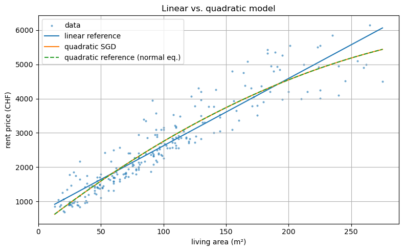
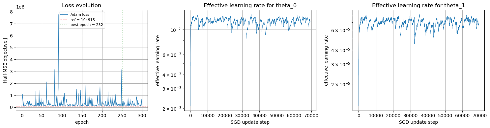

# SGD Optimizer Extensions for Linear Regression

Five extensions to a gradient-descent linear regression pipeline, built on a
custom computational graph (`cgnodes.py`) using rent price data from Lausanne.
No PyTorch or TensorFlow: all forward passes and gradients implemented from scratch.

> **Adam converges within 0.03% of the closed-form analytical minimum**
> (J = 104,949 vs. reference 104,915).
> All five extensions benchmarked against the normal-equations solution.

---

## Results

All methods compared against the closed-form normal-equations solution (J = 104,915).

| Method | Solves scale problem | Final J | Main limitation |
|---|:---:|---|---|
| Vanilla SGD (raw input) | No | 163,432 | LR too small for θ₀, too large for θ₁ |
| Batched GD (raw input) | No | 163,532 | Fewer updates per epoch worsen θ₀ convergence |
| Separate learning rates | Partially | 104,946 | Ratio must be tuned manually per dataset |
| Momentum | Partially | 105,020 | β values require manual tuning |
| Early stopping | No | 104,957 | Saves compute but does not address gradient scale |
| Learning-rate decay | No | 104,942 | Stabilises training but convergence remains slow |
| Normalised SGD | Yes | 104,916 | Requires preprocessing and back-transformation |
| Adam (raw input) | Partially | 104,949 | Adaptive scaling helps but noisy with aggressive LR |
| **Normal equations (reference)** | **N/A** | **104,915** | **Closed-form, not scalable to large datasets** |

---

## Approach

| # | Extension | Key idea |
|---|---|---|
| 1 | **Input Standardisation** | Zero-mean / unit-variance normalisation enables a single shared learning rate |
| 2 | **Early Stopping** | Halt training when loss falls below a threshold for `patience` epochs |
| 3 | **Learning Rate Decay on Plateau** | Halve the LR instead of stopping, allows continued refinement |
| 4 | **Quadratic Model** | Extend the hypothesis with an x² term for better fit on non-linear data |
| 5 | **Adam Optimizer** | First and second moment estimates with bias correction |

---

## Key Findings

**Input standardisation is the most reliable fix for gradient scale imbalance.**
Normalised SGD reaches J = 104,916, within one unit of the analytical minimum,
without any adaptive mechanism. Adam on raw inputs also converges well but
produces a noisier training trajectory due to the aggressive global learning rate.

**Adam adapts automatically but does not eliminate the need for tuning.**
The spiky loss curve and wide parameter oscillations on raw inputs show that
adaptive scaling reduces the sensitivity to feature scale but does not remove it.
A smaller learning rate (e.g. 0.5 instead of 10.0) would produce a smoother path.

**The quadratic model captures real structure in the data.**
The linear model systematically overpredicts rent at large living areas. Adding an
x² term corrects this and achieves around 10% lower MSE, confirmed against the
quadratic normal-equations reference.

**All scale-aware methods converge to the same solution neighbourhood.**
Normalised SGD, Adam, and separate learning rates all reach a final J within 35
units of the analytical minimum. The main difference is training stability and the
amount of manual tuning required.

---

## Visualisations

### Quadratic vs. linear model fit

The quadratic extension reduces MSE by around 10% compared to the linear baseline
and tracks the curvature in the data at larger living areas.

### Adam: loss trajectory and effective learning rates

Adam reaches J = 104,949 at epoch 252, within 0.03% of the analytical minimum.
The effective learning rate for θ₁ stabilises around 6×10⁻⁵, roughly 167× lower
than for θ₀, directly compensating for the gradient scale imbalance.

